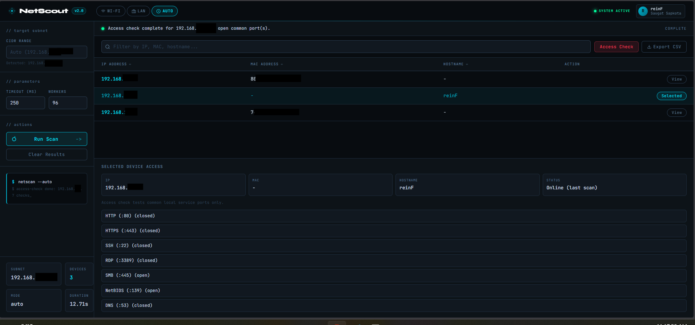

# LAN Pulse Scanner

Developer: reinF (Saugat Sapkota.)

LAN Pulse Scanner helps you discover devices connected to your current network.
It includes both:
- A command-line scanner
- A web dashboard with filters, sorting, and device details

## Dashboard Preview



## What This Project Does

- Scans the local subnet for active hosts
- Shows device IP address
- Tries to resolve MAC address from ARP
- Tries to resolve hostname using reverse DNS
- Supports Wi-Fi mode, LAN mode, and auto mode in the web app

## What This Project Does Not Do

- It does not inspect private app usage (for example, Instagram activity)
- It does not perform packet-level monitoring
- It does not guarantee detection of every device (some devices block ping)

## Requirements

- Windows
- Python 3.8 or newer
- Flask (for the web dashboard)

## Quick Start

1. Open terminal in this project folder.
2. Install Flask:

```bash
py -m pip install flask
```

3. Start the web app:

```bash
py app.py
```

4. Open your browser:

```text
http://127.0.0.1:5050
```
git commit -m "Netscout v1.0"

## Command Line Scanner

Run basic scan:

```bash
py wifi_scanner.py
```

Run with manual subnet:

```bash
py wifi_scanner.py --subnet 192.168.1.0/24
```

Run with custom speed settings:

```bash
py wifi_scanner.py --timeout 300 --workers 128
```

### CLI Options

- --subnet
	Manual subnet in CIDR format. Example: 192.168.1.0/24
- --timeout
	Ping timeout per host in milliseconds
- --workers
	Number of parallel ping workers

## Web Dashboard Features

- Separate scan controls:
	Wi-Fi scan, LAN scan, and Auto scan
- Device table with IP, MAC, and hostname
- Click a row action to view selected device details
- Detail log panel for scan and selection events
- Search/filter over discovered devices
- Sort by column
- Export currently visible results to CSV

## How Device Type Detection Works

The dashboard labels devices as Mobile, Laptop/PC, or Unknown.
This is estimated from hostname patterns, so it may not always be exact.

## Accuracy Notes

- MAC may appear as "-" if the ARP table has not learned that host yet
- Hostname may appear as "-" if reverse DNS is unavailable
- Some devices may be online but hidden due to firewall/ping restrictions

## Troubleshooting

### Python command not found

Use py instead of python:

```bash
py --version
```

If py is also missing, install Python from the official installer and enable PATH.

### Web page loads but scan fails with HTTP 405

Make sure you open the app through Flask:

- Correct: http://127.0.0.1:5050
- Incorrect: opening templates/index.html directly from a static server

### Scan is slow

Try higher workers and lower timeout (carefully):

```bash
py wifi_scanner.py --timeout 150 --workers 128
```

## Safety and Privacy

- Use this tool only on networks you own or are authorized to manage
- Respect local laws and other users' privacy
- This project is intended for network visibility and diagnostics

## Future Improvements (Optional)

- Vendor lookup from MAC prefix
- History view for device join/leave events
- Router API integrations for managed access control (when supported)
